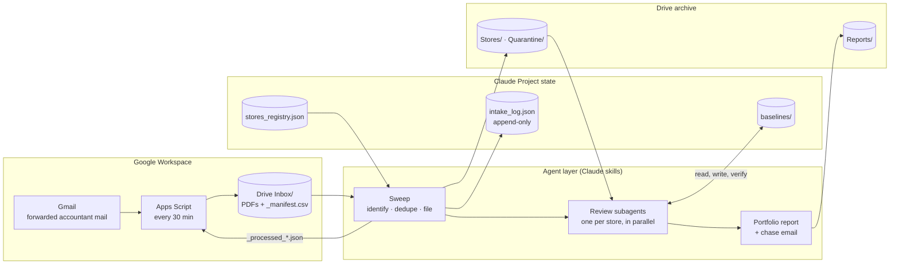
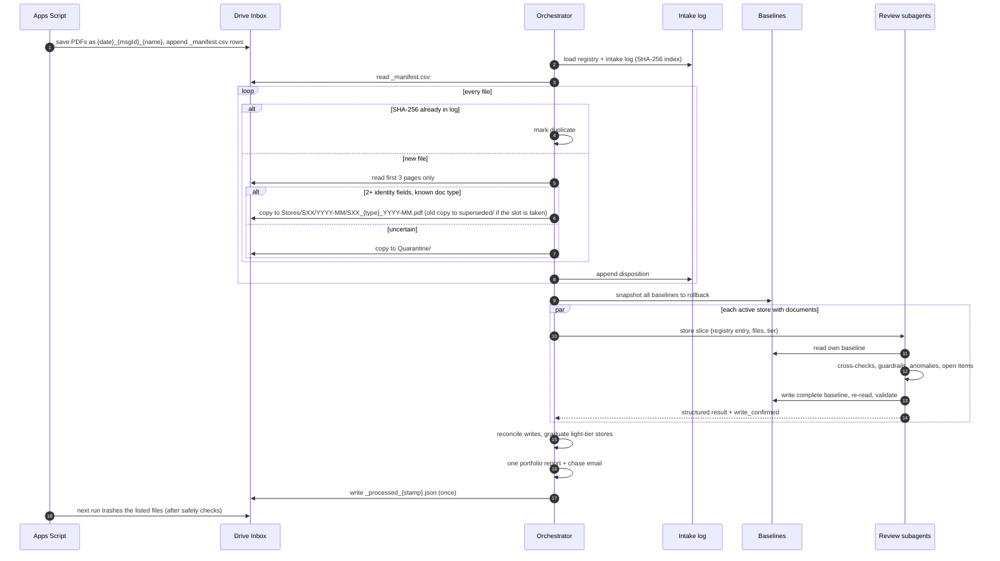

# Architecture

The system has two halves with a strict contract between them. The **Apps Script** is the "dumb half": it moves files and executes lists, and it never makes a decision. The **agent** is the half that decides: what a document is, where it goes, and what it means. Every stage can be re-run safely, and nothing is deleted without a certified list.

## System overview



## Google Drive folder tree

The Apps Script's `setupDrive()` builds this once, and every later lookup finds folders by name, so no folder IDs are stored anywhere.

```
PnLAnalyze/
├── Inbox/                      the script writes here; the agent sweeps it
│   ├── 20260908_c1e15fbd_Riverside_Aug2026_Financials.pdf
│   ├── LINK_ONLY_20260913_dae9c274.txt
│   ├── _manifest.csv           one row per saved file (with SHA-256); never deleted
│   ├── _processed_{stamp}.json cleanup list written by the agent, executed by the script
│   └── _cleanup_error_{stamp}.txt  written by the script if a cleanup fails
├── Stores/
│   └── S01/2026-08/            the archive: S01_FR_2026-08.pdf, S01_GL_…, S01_BR_…
│       └── superseded/         earlier copies replaced by a correction, date-stamped
├── Quarantine/                 documents that failed the identity rule, each with a .reason.txt
├── Reports/                    YYYY-MM_portfolio_report.md, one per month
└── Portfolio/                  dashboards and cross-store views
```

The state the agent reads and writes every run (registry, intake log, baselines) lives with the skills in a Claude Project, not in Drive.

## One monthly run



## Components

| Component | Where | Responsibility |
|---|---|---|
| Intake script | [`apps-script/Code.gs`](../apps-script/Code.gs) | Saves PDFs with provenance names, writes `_manifest.csv` (with SHA-256), labels threads, remembers processed message IDs, writes `LINK_ONLY` notes, executes cleanup lists with safety checks, builds the Drive tree |
| Sweep | [`agent/skills/process-inbox`](../agent/skills/process-inbox/SKILL.md) · [`sweep_procedure.md`](../agent/procedures/sweep_procedure.md) | One disposition per Inbox file, completeness matrix, one cleanup certification; never extracts figures |
| Review | [`monthly_analysis_procedure.md`](../agent/procedures/monthly_analysis_procedure.md) | One store, one baseline, one structured result |
| Orchestrator | [`agent/skills/analyze-month`](../agent/skills/analyze-month/SKILL.md) | Sequencing, parallel fan-out, write reconciliation, tier graduation, the consolidated report |
| Registry validator | [`tools/validate_registry.js`](../tools/validate_registry.js) | Catches registry mistakes (duplicate IDs, stores that can't meet the identity rule) before upload |
| Demo mode | [`src/pnl_analyzer/`](../src/pnl_analyzer/) | Deterministic reference implementation of the sweep and review, run on synthetic data |

## Contracts

**`_manifest.csv`** (script → agent), one row per saved file:

`received_ts, gmail_message_id, from_addr, subject, original_filename, drive_file_id, sha256, note`

**`_processed_{stamp}.json`** (agent → script), written once per run:

```json
{ "written_by": "agent sweep", "sweep_date": "2026-09-15",
  "trash": [ { "drive_file_id": "…", "title": "…", "reason": "filed|duplicate|quarantined|link_only_logged|superseded_old_canonical" } ] }
```

The script trashes a listed file only if it is not `_manifest.csv`, not a folder, and inside the project's Drive tree. Anything it refuses or fails on goes into `_cleanup_error_{stamp}.txt`, which the next sweep reports first. The list itself is retired after one execution, so a bad list is never retried forever.

**`stores_registry.json`**: per store, the identity fields (`legal_entity`, `store_code`, `address_fragment`, `bank_accounts`), `status` (`active` or `filed-only`), `tier` (`active` or `light`), accountant, related parties, and baseline path. [Example](../sample-data/seed/stores_registry.json).

**`intake_log.json`**: append-only; one entry per file with `sha256`, `received`, `source_msg_id`, `original_filename`, `store`, `type`, `period`, `disposition`, `final_path`, and `sweep_date`. It is both the dedup index and the audit trail.

**`baselines/SXX_baseline.json`**: each store's memory. Validated by [`schemas/baseline.schema.json`](../schemas/baseline.schema.json).

| Key | Purpose |
|---|---|
| `meta` | Store, entity, last closed month, last updated |
| `monthly_history` | Metric → month → value (net sales, net income, every P&L line, delivery lag, packet status) |
| `ratio_guardrails_pct_of_net_sales` | Each line's observed % of sales and normal range |
| `vendor_baselines` | Known payees with role, bands, fixed amounts; new payees enter as `MONITOR` |
| `capital_projects` | Capitalized spending (invisible on the P&L) with running totals |
| `seasonality_notes` | Expected seasonal moves, applied before flagging |
| `open_items_carryforward` / `resolved_items` | Loose ends with IDs `OI-YYYY-MM-X`; nothing leaves without evidence |

## Division of labor: the model reads, code checks

Reading a messy PDF is what a language model is good at; adding up a bank reconciliation is not. So the review is split at a data contract, [`schemas/extraction.schema.json`](../schemas/extraction.schema.json):

```text
PDFs ──(agent reads)──▶ extraction JSON ──(code checks)──▶ flags + updated baseline ──(agent explains)──▶ report
```

- **Agent:** identify and classify documents, transcribe figures exactly, then interpret the computed flags and write the questions.
- **Code** ([`analyze.py`](../src/pnl_analyzer/analyze.py)): tie-outs, bank-rec math, duplicate detection, stale-check aging, variance against baseline, open-item resolution. It is exact, repeatable, cheaper than a model call, and testable.

The reference implementation plays the agent's part with a PDF parser and writes the same JSON, so `--dump-extracted` gives a ground truth and `--extracted-dir` runs the checks on an agent's transcription. Each rule in `analyze.py` is a small function from plain data to flags (`check_tieout`, `check_duplicates`, `check_bank_rec`, ...), unit-tested on its own; a new rule is one function plus one call in `review_store`. [`evaluation.md`](evaluation.md) covers scoring the agent against the reference.

## Review rules

The full rules are in the [review procedure](../agent/procedures/monthly_analysis_procedure.md). In summary:

| Check | Rule |
|---|---|
| Completeness | P&L + GL + one BR per registered bank account. A partial packet is reviewed but the month isn't closed. With several accounts each BR gets its own slot (`SXX_BR1_…`, `SXX_BR2_…`), chosen from the account line printed on it, and each is reconciled separately. |
| Delivery lag | Packet completion date − month-end. **Late** once it exceeds the store's median lag + 5 days. |
| Cross-checks | BR adjusted book balance = GL cash; unreconciled amount = 0; P&L lines = GL account totals; management fee and royalty match their contractual rules. |
| Guardrails | Each ratio against its normal range, with the dollar impact of any breach; 3 months drifting the wrong way is a MONITOR flag. |
| Seasonality | Applied before anything is flagged. |
| Transactions | Vendor bands, new payees, missing recurring charges, fixed-amount drift, lumpy repair accounts, capitalized purchases, duplicates, round numbers, distributions. |
| Standing red flags (every tier) | BR unreconciled · management fee off-rule · new vendor over $1,000 · utility over 1.5× its median · open checks over 90 days · payroll drift over 15% · inventory adjustments over 1 point · cash short/over beyond ±$100 |

## Failure handling

| Situation | Behavior |
|---|---|
| Two script runs overlap | A script lock makes the second run exit immediately. |
| Resend lands in an already-processed thread | The catch-up query sees it; message-ID memory stops old messages being saved twice. |
| Document can't be identified | Quarantined and listed in the report. Never guessed. |
| Same file arrives twice | Skipped by SHA-256. The duplicate is logged. |
| Month rerun (new documents, or a retry) | The review first undoes its own earlier effects on that month (open items it opened, items it resolved, vendors it first saw), compares only against earlier months, and keeps the rollback snapshot from the first run, so a rerun gives the same result as the first run would have with the same documents. |
| Corrected document arrives | It takes the canonical name; the old copy is kept in `superseded/` and its canonical file is certified for trash. An already-reported month is re-analyzed and its report reissued as `_rev2`. |
| Email has no attachment | The `LINK_ONLY` note is read, logged, and certified for cleanup; any links in it are flagged for a person, and the chase email asks for the PDF. |
| First month, or zero sales | A store with no history has nothing to compare against, so variance is skipped, the standing red flags still run, and the month becomes the baseline. A month with zero net sales is flagged high; percent-of-sales checks are skipped and the month is left out of later percent statistics. |
| An extraction leaves out a document that was filed | Completeness is judged from what intake filed, so an extraction JSON that omits the P&L, the GL or a bank rec (or reads nothing from it) cannot close the month. The packet is marked incomplete, the checks that needed the document are reported as not run, and an open item says which document to extract. The accountant is not asked for something they already sent. |
| Packet incomplete | Available documents are reviewed and the section is stamped INCOMPLETE. The month stays open, with an open item and a chase line. |
| Evidence for an open item is in a missing document | Carried forward as "cannot verify this month"; never auto-resolved. |
| Baseline write fails verification | The orchestrator attempts a fallback write; if that fails, the store is reported as not closed at the top of the report. The rollback snapshot is intact. A light-tier store is only promoted to active after its baseline write is confirmed. |
| Cleanup fails or is refused | The script writes `_cleanup_error_{stamp}.txt`; the next sweep surfaces it first. Trashed files are recoverable for 30 days. |
| Run crashes midway | The certification is still written with whatever was fully dispositioned, and baselines can be restored from the rollback snapshot. |

## Configuration and secrets

The intake script reads its environment from **Script Properties** (Project Settings → Script Properties), never from code:

| Property | Required | Default |
|---|---|---|
| `INTAKE_ADDRESS` | yes | none (the dedicated address accountant mail is forwarded to) |
| `PROCESSED_LABEL` | no | `pnl/ingested` |
| `ROOT_FOLDER` | no | `PnLAnalyze` |

The script also stores its processed-message-ID memory there. clasp's credential file (`.clasprc.json`) and project file (`.clasp.json`) are excluded by `.gitignore`.
